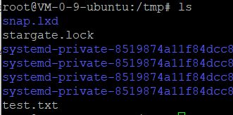
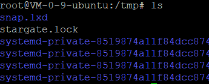
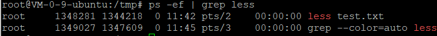
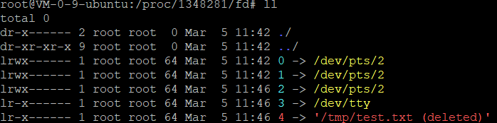
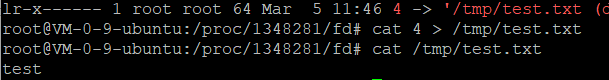

# Proc

**Description**

Proc file system (procfs) is virtual file system created on fly when system boots and is dissolved at time of system shut down. It contains the useful information about the processes that are currently running, it is regarded as control and information centre for kernel.

[Proc]('https://tldp.org/LDP/Linux-Filesystem-Hierarchy/html/proc.html')

在Linux系统中，所有的内容都被视为文件。

## /Proc

1. **/proc/PID/cmdline**

   Command line arguments.

   ```shell
   cat /proc/PID/cmdline 打印执行的语句
   ```

2. **/proc/PID/cpu**

   Current and last cpu in which it was executed.

3. **/proc/PID/cwd**

   Link to the current working directory.

4. **/proc/PID/environ**

   Values of environment variables.

   ```shell
   cat /proc/PID/environ
   ```

5. **/proc/PID/exe**

   Link to the executable of this process.

   ```shell
   ./exe 参数
   exe 是关联的程序
   比如less /tmp/test.txt
   可以直接
   ./exe /tmp/test.txt
   ```

6. **/proc/PID/fd**

   Directory, which contains all file descriptors.

7. **/proc/PID/maps**

   Memory maps to executables and library files.

8. **/proc/PID/mem**

   Memory held by this process.

9. **/proc/PID/root**

   Link to the root directory of this process.

10. **/proc/PID/stat**

    Process status.

11. **/proc/PID/statm**

    Process memory status information.

12. **/proc/PID/status**

    Process status in human readable form.

## 利用/Proc找回文件

### 条件

尚有程序在使用该文件

模拟场景:

```shell
vim /tmp/test.txt
```



控制台程序A

```shell
less /tmp/test.txt
```


控制台程序B

```shell
rm -rf /tmp/test.txt
```



查看程序A进程PID

```shell
ps -ef | grep less
```



打开/proc/PID/fd，执行ll命令

```
cd /proc/1348281/fd
```



恢复文件

```shell
cat 4  > /tmp/test.txt
```

