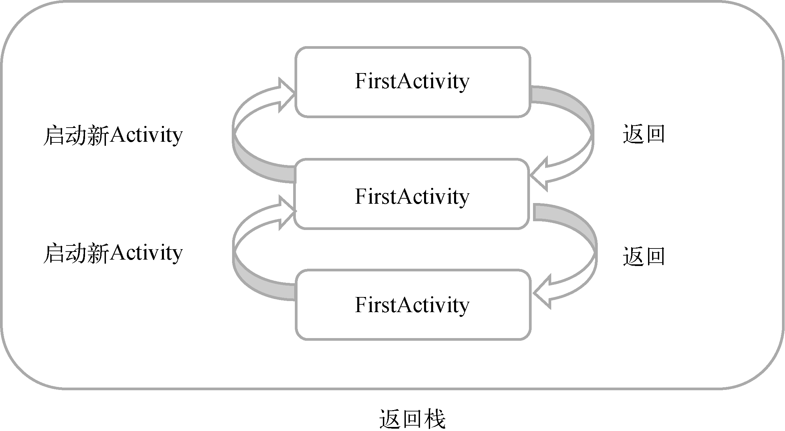
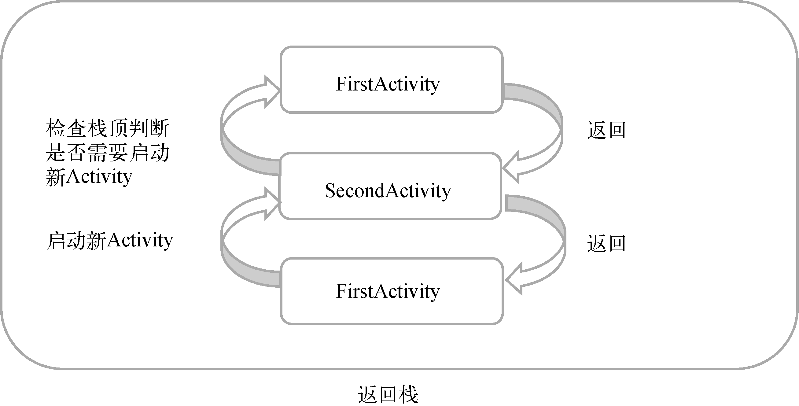
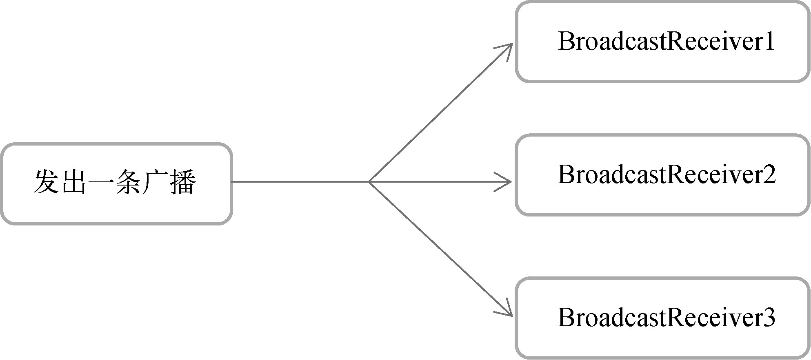
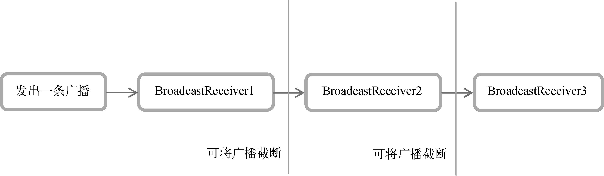

# `Android`基础知识

## 四大组件

1. Activity
2. Service
3. BroadcastReceiver
4. ContentProvider

## SQLite数据库

轻量级、运算速度极快嵌入式关系型数据库

## Log日志打印

1. Log.v() 最琐碎的、意义最小的日志信息
2. Log.d() 调试信息
3. Log.i() 比较重要的数据
4. Log.w() 警告信息
5. Log.e() 错误信息

## Activity启动的几种方式

AcivityName 活动名称

显式启动

```kotlin
val intent = Intent(this, ActivityName::class.java)
startActivity(intent)
```

隐式启动

1. AndroidMainfest.xml

   ```xml
   <activity android:name=".ActivityName">
   	<intent-filter>
   		<action android:name="com.example.activitytest.ActivityName"/> // Activity Path
   		<!--1.-->
   		<category android:name="android.intent.category.DEFAULT"/>	// category名称
   		<!--2.-->
   		<!--<category android:name="com.example.activitytest.MY_CATEGORY"/>	// category名称-->
   	</intent-filter>
   </activity>
   ```

   ```kotlin
   val intent = Intent("com.example.activitytest.ActivityName")
   // 2.
   // intent.addCategory("com.example.activitytest.MY_CATEGORY")
   StartActivity(intent)
   ```

2. 调用外部应用程序

   ```kotlin
   val intent = Intent(Intent.ACTION_VIEW)
   intent.data = Uri.parse('https://www.baidu.com')
   startActivity(intent)
   ```

## intent-filter标签

属性

1. android:icon 一个表示父Activity、服务或广播接收器的图标
2. android:label 父组件的用户可读标签
3. android:priority  处理过滤器所描述类型的intent，应该为父组件指定优先级。此属性对Activity和广播接收器都有意义
4. android:order 当多个过滤器匹配应该按什么顺序处理过滤器

必须包含

1. action 在name属性中，声明接受的 Intent 操作

可包含

1. category 在name属性中，声明接收的Intent类别
2. data 线性依赖关系
   1. android:scheme 指定数据协议部分
   2. android:host 指定数据的主机部分
   3. android:port 指定数据的端口部分
   4. android:path 指定主机名和端口之后的部分
   5. android:mimeType 指定可以处理的数据类型

## Activity通信

1. 向下一个Activity传递数据

   ```kotlin
   val data = "Hello NextActivity"
   val intent = Intent(this, NextActivity::class.java)
   intent.putExtra("extra_data", data)
   startActivity(intent)
   ```

   ```kotlin
   val extraData = intent.getStringExtra("extra_data")
   ```

2. 向上一个Actvity传递数据

   ```kotlin
   startActivityForResult (intent : Intent, requestCode : int)
   ```

   ```kotlin
   val intent = Intent()
   intent.putExtra("data_return", "Hello LastActivity")
   setResult(RESULT_OK, intent)
   finish()
   ```

   ```kotlin
   override fun onActivityResult(requestCode: Int, resultCode: Int, data: Intent?) {
       super.onActivityResult(requestCode, resultCode, data)
       when (requestCode) {
           1 -> if (resultCode == RESULT_OK) {
               val returnedData = data?.getStringExtra("data_return")
               Log.d("LastActivity", "returned data is $returnedData")
           }
       }
   }
   ```

## Activity的生命周期

### Activity栈

Android是使用任务(task)来管理Activity的Activity的，一个任务就是一组存放在栈里的Activity的集合，这个栈也被称作返回栈(back stack)。


### Activity状态

每个Activity在其神明周期中最多可能会有4种状态。

1. **运行状态**

   Activity处于栈顶时，系统最不愿回收的Activity。

2. **暂停状态**

   Activity不再处于栈顶位置，对话框形式的Activity在原Activity上。系统也不愿意回收这种Activity。

3. **停止状态**

   当一个Activity不再处于栈顶位置，并且完全不可见的时候，处于停止状态。系统会为其保存相应的状态和成员变量，当前其它地方需要内存时，此Activity可能被系统回收。

4. **销毁状态**

   一个Activity从返回栈种移除后就变成了销毁状态。系统最倾向于回收这种状态的Activity，以保证手机的内存充足。

### Activity的生存期

Activity类中定义了**7个回调方法**。

1. onCreate()

   Acitivity在第一次被创建的时候调用

2. onStart()

   Activity由不可见变为可见的时候调用

3. onResume()

   Activity准备好与用户交互的时候调用。此时的Activity一定位于返回栈的栈顶，并处于运行状态。

4. onPause()

   系统准备去启动或者恢复另一个Activity的时候调用。常在此释放一些消耗CPU的资源，保留一些关键数据，这个方法的执行速度要快，不然会影响到新的栈顶Activity的使用。

5. onStop()

   Activity完全不可见的时候。它和onPause()方法的主要区别在于，如果启动的新Activity是一个对话框式的Activity，那么onPause()方法会得到执行，而onStop()方法并不会执行。

6. onDestroy()

   Activity销毁之前调用

7. onRestart()

   Activity重启时调用，停止状态变为运行状态

4. Activity的生存期

   1. 完整生存期

      Activity在onCreaete()方法和onDestory()方法之间所经历的就是完整的生存期。

      onCreate()完成资源初始化，onDestory()完成释放内存的操作。

   2. 可见生存期

      Activity在onStart()方法和onStop()方法之间所经历的就是可见生存期。

      onStart()进行资源加载，onStop()进行资源释放。

   3. 前台生存期

      Activity在onResume()方法和onPause()方法之间所经历的就是前台生存期。

      Activity总是处于运行状态。
   
   

## Activity数据保存

Activity采用Bundle保存数据，避免在Activity意外销毁时，数据丢失

```kotlin
override fun onSaveInstanceState(outState: Bundle) {
	super.onSaveInstanceState(outState)
	val tempData = "Something you just typed"
	outState.putString("data_key", tempData)
}
```

```kotlin
override fun onCreate(savedInstanceState: Bundle?) {
	super.onCreate(savedInstanceState)
	if (savedInstanceState != null) {
		val tempData = savedInstanceState.getString("data_key")
		Log.d(tag, "tempData is $tempData")
	}
	......
}
```

## Activity启动模式

AndroidManifest.xml中，通过给<activity>标签指定android:launchMode属性来选择启动模式

栈管理

1. standard

   

2. singleTop

   

3. singleTask

   

4. singleInstance

   

##  杀死进程

杀死所有Activity之后，在将自身Kill掉。这段代码只能杀死自己本身。

```kotlin
android.os.Process.killProcess(android.os.Process.myPid())
```

## 布局方式

1. ConstrainLayout 约束性布局

2. LinearLayout 线性布局

   多余一个组件时，要使用orientation设置对齐方式（vertical、horizontal）

3. RelativeLayout 相对布局

   可以相对于父布局布局

   也可以相对于控件布局

4. FrameLayout 帧布局

   较少用，它会默认把控件放在左上角，堆在一起


## 控件

1. TextView
2. EditView
3. Button
4. ImageView
5. ProgressBar
6. AlertDialog
7. ListView
8. RecyclerView

## 控件注册

1. 函数式API注册监听器

   ```kotlin
   class MainActivity : AppCompatActivity() {
   
       override fun onCreate(savedInstanceState: Bundle?) {
           super.onCreate(savedInstanceState)
           setContentView(R.layout.activity_main)
           button.setOnClickListener {
               // 在此处添加逻辑
           }
       }
   
   }
   ```

2. 接口方式注册

   ```kotlin
   class MainActivity : AppCompatActivity(), View.OnClickListener {
   
       override fun onCreate(savedInstanceState: Bundle?) {
           super.onCreate(savedInstanceState)
           setContentView(R.layout.activity_main)
           button.setOnClickListener(this)
       }
   
       override fun onClick(v: View?) {
           when (v?.id) {
               R.id.button -> {
                   // 在此处添加逻辑
               }
           }
       }
   
   }
   ```

## 控件的可见属性

```kotlin
android:visibility
```

1. visible

   控件可见

2. invisible

   控件不可见，但仍然占据着原来的位置和大小

3. gone

   控件不可见，而且不在占据任何屏幕控件

## 布局属性

1. android:gravity

   控件内容对齐方式

2. android:layout_gravity

   控件对齐方式

3. android:layout_weight

   layout_weight: 0dp

   百分比平分屏幕

## 控件和布局继承结构


## 隐藏标题栏

```kotlin
supportActionBar?.hide()
```

## ListView性能优化布局缓存

convertView中存在布局的缓存，直接对convertView进行绑定。

```
class FruitAdapter(activity : Activity, val resourceId : Int, data: List<Fruit>) : ArrayAdapter<Fruit>(activity, resourceId, data) {

    private lateinit var binding : FruitItemBinding
    
    override fun getView(position: Int, convertView: View?, parent: ViewGroup): View {
        binding = if (convertView == null) {
            FruitItemBinding.inflate(LayoutInflater.from(context), parent, false)
        } else {
            FruitItemBinding.bind(convertView)
        }
		return binding.root
	}
}
```

## ListView性能优化实例缓存

利用内部类ViewHolder生成item的实例进行缓存

```kotlin
class FruitAdapter(activity : Activity, resourceId: Int, data: List<Fruit>) : ArrayAdapter<Fruit>(activity, resourceId, data) {

    private lateinit var binding : FruitItemBinding

    inner class ViewHolder(val fruitImage : ImageView, val fruitName : TextView)
    override fun getView(position: Int, convertView: View?, parent: ViewGroup): View {

        val viewHolder : ViewHolder
        if (convertView == null) {
            binding = FruitItemBinding.inflate(LayoutInflater.from(context), parent, false)
            val fruitImage : ImageView = binding.fruitImage
            val fruitName : TextView = binding.fruitName
            viewHolder = ViewHolder(fruitImage, fruitName)
            binding.root.tag = viewHolder
        } else {
            binding = FruitItemBinding.bind(convertView)
            viewHolder = binding.root.tag as ViewHolder
        }

        val fruit = getItem(position)   // 获取当前Fruit实例
        if (fruit != null) {
            viewHolder.fruitImage.setImageResource(fruit.ImageId)
            viewHolder.fruitName.text = fruit.name
        }
        return binding.root
    }
}
```

## Fragment

Fragment是一种可以嵌入在Activity当中的UI片段，它能让程序更加合理和充分地利用大屏幕的空间

### 动态添加Fragment

1. 创建待添加Fragment的实例。
2. 获取FragmentManager，在Activity中可以直接`getSupportFragmentManager()`方法获取。
3. 开启一个事务，通过调用`beginTransaction()`方法开启。
4. 向容器内添加或替换Fragment，一般使用`replace()`方法实现，需要传入容器的id和待添加的Fragment实例。
5. 提交事务，调用`commit()`方法来完成。

### Fragment中实现返回栈

`addToBackStack()`

## Fragment与Activity之间的交互

### Activity获取Fragment实例

```
findFragmentById()
```

### Fragment获取Activity实例

```
getActivity()
```

## Fragment的生命周期

### Fragment的状态

1. **运行状态**
2. **暂停状态**
3. **停止状态**
4. **停止状态**

### Fragment的回调

1. **onAttach()**
2. **onCreateView()**
3. **onActivityCreated()**
4. **onDestroyView()**
5. **onDetach()**

### Fragment完整的生命周期


## Android常见限定符

| 屏幕特征 | 限定符   | 描述                                            |
| :------- | :------- | :---------------------------------------------- |
| 大小     | `small`  | 提供给小屏幕设备的资源                          |
|          | `normal` | 提供给中等屏幕设备的资源                        |
|          | `large`  | 提供给大屏幕设备的资源                          |
|          | `xlarge` | 提供给超大屏幕设备的资源                        |
| 分辨率   | `ldpi`   | 提供给低分辨率设备的资源（120 dpi以下）         |
|          | `mdpi`   | 提供给中等分辨率设备的资源（120 dpi~160 dpi）   |
|          | `hdpi`   | 提供给高分辨率设备的资源（160 dpi~240 dpi）     |
|          | `xhdpi`  | 提供给超高分辨率设备的资源（240 dpi~320 dpi）   |
|          | `xxhdpi` | 提供给超超高分辨率设备的资源（320 dpi~480 dpi） |
| 方向     | `land`   | 提供给横屏设备的资源                            |
|          | `port`   | 提供给竖屏设备的资源                            |

## 广播机制

**BroadcastReceiver**

### 标准广播(normal broadcasts)

```kotlin
sendBroadcast(Intent intent) {
	mBase.sendBroadcast(intent);
}
sendBroadcast(Intent intent, String receiverPermission) {
	mBase.sendBroadcast(intent, receiverPermission);
}
```

一种完全异步执行的广播，在广播发出之后，所有的BroadcastReceiver几乎同一时刻收到广播消息。这种广播无法被截断。



### 有序广播(orderd broadcasts)

```
sendOrderedBroadcast(Intent intent, String receiverPermission) {
	mBase.sendOrderedBroadcast(intent, receiverPermission);
}
```

一种同步执行的广播，在广播发出之后，同一时刻只会有一个BroadcastsReceiver收到广播消息，当这个BroadcastReceiver中的逻辑执行完毕后，广播才会继续传递。前面的BroadcastsReceiver可以截断正在传播的消息。



### 阻止有序广播传播

```kotlin
abortBroadcast()
```


### 注册方法

1. **动态注册**

   在代码中注册

   ```kotlin
   class MainActivity : AppCompatActivity() {
   
       private lateinit var timeChangeReceiver:TimeChangeReceiver
       private lateinit var binding : ActivityMainBinding
   
       override fun onCreate(savedInstanceState: Bundle?) {
           super.onCreate(savedInstanceState)
           binding = ActivityMainBinding.inflate(layoutInflater)
           setContentView(binding.root)
           val intentFilter = IntentFilter()
           intentFilter.addAction("android.intent.action.TIME_TICK")
           timeChangeReceiver = TimeChangeReceiver()
           registerReceiver(timeChangeReceiver, intentFilter)
       }
   
       override fun onDestroy() {
           super.onDestroy()
           unregisterReceiver(timeChangeReceiver)
       }
   
       inner class TimeChangeReceiver : BroadcastReceiver() {
           override fun onReceive(context: Context?, intent: Intent?) {
               Toast.makeText(context, "Time has changed", Toast.LENGTH_SHORT).show()
           }
   
       }
   }
   ```

   **系统广播列表**

   ```kotlin
   <Android SDK>/platforms/<任意android api版本>/data/broadcast_actions.txt
   ```

   **缺陷**

   必须在程序启动后才能接收广播

2. **静态注册**

   [可静态注册的广播]('https://developer.android.google.cn/guide/components/broadcast-exceptions.html')

   在AndroidManifest.xml中注册

   BootCompleteReceiver.kt

   ```kotlin
   class BootCompleteReceiver : BroadcastReceiver() {
   
       override fun onReceive(context: Context, intent: Intent) {
           // This method is called when the BroadcastReceiver is receiving an Intent broadcast.
           Toast.makeText(context, "Boot Complete", Toast.LENGTH_SHORT).show()
       }
   }
   ```

   AndroidManifest.xml

   ```xml
   <manifest xmlns:android="http://schemas.android.com/apk/res/android"
           package="com.example.broadcasttest">
   
       <uses-permission android:name="android.permission.RECEIVE_BOOT_COMPLETED" />
   
       <application
           android:allowBackup="true"
           android:icon="@mipmap/ic_launcher"
           android:label="@string/app_name"
           android:roundIcon="@mipmap/ic_launcher_round"
           android:supportsRtl="true"
           android:theme="@style/AppTheme">
           ...
           <receiver
               android:name=".BootCompleteReceiver"
               android:enabled="true"
               android:exported="true">
               <intent-filter>
                   <action android:name="android.intent.action.BOOT_COMPLETED" />
               </intent-filter>
           </receiver>
       </application>
   
   </manifest>
   ```

   在Android8.0系统之后，静态注册的BroadcastReceiver是无法接收隐式广播的，而默认情况下我们发出的自定义广播都是隐式广播。所以要使用setPackage()方法。

# 数据存储

**持久化技术**

将那些内存中的瞬时数据保存到存储设备中，保证即使在手机或计算机关机的情况下，这些数据仍然不会丢失。

持久化技术提供了一种机制，可以让数据在瞬时状态和持久状态之间进行转换。

## 三种持久化技术

1. 文件存储
2. SharedPreferences存储
3. 数据库存储

### 文件存储

默认存储位置

/data/data/<package name>/files/

文件操作模式

1. `MODE_PRIVATE`

   指定相同文件名的时候，所写入的内容将会覆盖原文件中的内容

2. `MODE_APPEND`

   如果该文件已存在，就往文件里面追加内容，不存在就创建新文件

#### **存储**

```kotlin
fun save(inputText: String) {
    try {
        val output = openFileOutput("data", Context.MODE_PRIVATE)
        val writer = BufferedWriter(OutputStreamWriter(output))
        writer.use {
            it.write(inputText)
        }
    } catch (e: IOException) {
        e.printStackTrace()
    }
}
```

#### **读取**

```kotlin
fun load(): String {
	val content = StringBuilder()
	try {
		val input = openFileInput("data")
		val reader = BufferedReader(InputStreamReader(input))
		reader.use {
			reader.forEachLine {
				content.append(it)
			}
		}
	} catch (e: IOException) {
		e.printStackTrace()
	}
	return content.toString()
}
```

### SharedPreferences

**使用该技术时需要先获取SharedPreferences对象**

SharedPreferences存放路径`/data/data/<package name>/shared_prefs/`

只存在`MODE_PRIVATE`操作模式

#### 存储

SharedPreferences() 、getSharedPreferences()

1. 创建SharedPreferences对象的edit()方法获取实例
2. 向SharedPreferences对象中添加数据
3. 调用apply()提交数据，完成存储

##### Context类中的getSharedPreferences()方法

```kotlin
public abstract SharedPreferences getSharedPreferences(String name, @PreferencesMode int mode)
```

```kotlin
val editor = getSharedPreferences("data", Context.MODE_PRIVATE).edit()
editor.putString("name", "Tome")
editor.putInt("age", 28)
editor.putBoolean("married", false)
editor.apply()
```

##### Activity类中的getPreferences()方法

```kotlin
public SharedPreferences getPreferences(@Context.PreferencesMode int mode) {
	return getSharedPreferences(getLocalClassName(), mode);
}
```

文件将以该类名作为文件名

```kotlin
val editor = getPreferences(MODE_PRIVATE).edit()
editor.putString("name", "Tome")
editor.putInt("age", 28)
editor.putBoolean("married", false)
editor.apply()
```

#### 读取

```kotlin
val prefs = getSharedPreferences("data", Context.MODE_PRIVATE)
val name = prefs.getString("name", "")
val age = prefs.getInt("age", 0)
val married = prefs.getBoolean("married", false)
```

### SQLite数据库存储

支持标准SQL语法，遵循数据库的ACID事务

SQLiteOpenHelper

```kotlin
抽象方法
onCreate() 创建数据库
onUpgrade() 升级数据库
实例方法
getReadableDatabase()
getWriteableDatabase()
都会返回一个可以对数据库读写的对象

磁盘空间已满
getReadableDatabase()返回的对象将以只读的方式打开数据库
getWriteableDatabase()报错
```

**数据库文件路径存放路径**

/data/data/<package name>/databases/

**数据结构**

| 字段    | 说明     |
| ------- | -------- |
| null    | null     |
| integer | 整型     |
| real    | 浮点型   |
| text    | 文本类型 |
| blob    | 二进制   |

**属性**

| 属性          | 说明 |
| ------------- | ---- |
| autoincrement | 自增 |
| primary key   | 主键 |
| 待添加        |      |

#### SQLite数据操作

CRUD

1. create   添加
2. retrieve 查询
3. update  更新
4. delete    删除

insert()、query()、update()、delete()

**query()**

| query参数     | 对于SQL部分               | 描述                            |
| ------------- | ------------------------- | ------------------------------- |
| table         | from table_name           | 指定查询的表名                  |
| columns       | select column1, column2   | 指定查询的列名                  |
| selection     | where column = value      | 指定`where`的约束条件           |
| selectionArgs | -                         | 为`where`中的占位符提供具体的值 |
| groupBy       | group by column           | 指定需要`group by`的列          |
| having        | having column = value     | 对`group by`后的结果进一步约束  |
| orderBy       | order by column1, column2 | 指定查询结果的排序方式          |

#### SQLite事务支持

```kotlin
db.beginTransaction() // 开启事务
try {
	db.delete("Book", null, null)
	if (true) {
		// 手动抛出一个异常
		throw NullPointerException()
	}
	val values = ContentValues().apply {
		put("name", "Game of Thrones")
		put("author", "George Martin")
		put("pages", 720)
		put("price", 20.85)
	}
	db.insert("Book", null, values)
	db.setTransactionSuccessful() // 事务已经执行成功
}catch (e:Exception) {
	e.printStackTrace()
}finally {
	db.endTransaction() // 结束事务
}
```

